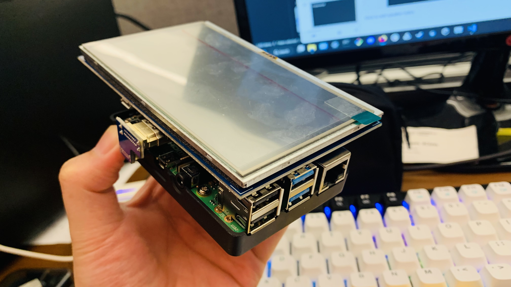

# Rasberry Pi - Meta Quest Pro Recording

There are 3 ways to capture raw footage capture of the passthrough AR camera feed that is shown to users of the Meta Quest Pro HMD:

1. **Turn on the Guardian System + in-built video recording.**
    * V47 of the Oculus system allows passthrough AR to be recorded, but only when the Guardian is on (which isn’t very conducive to us if we’re doing real-world studies)
2. **Use the Oculus mobile application + casting.**
    * Like the Guardian + in-built video recording, this option is only viable if you are using a Guardian system. This method only views virtual objects only otherwise.
3. **Record using SCRCPY.**
    * Requires an external PC to run - SCRCPY cannot be sideloaded into the Quest Pro like some app nor can it be run within a Unity project
    * The only way we can do this is have the SCRCPY program run on an external system that is connected to the Quest Pro via cable.

This repository **only concerns the SCRCPY approach**.

## Hardware Requirements

The SCRCPY approach requires the following materials

* A PC device capable of running unix bash commands
* The SCRCPY application software
* The Meta Quest Pro HMD
* USB-C connection cable


However, let us assume that you are running a mobile setup - meaning that you cannot maintain a connection to your stationary PC. You will require an alternative option such as some mobile PC. In this case, we suggest the following additional hardware:



* [Rasberry Pi 4](https://www.raspberrypi.com/products/raspberry-pi-4-model-b/) (or some other Ubuntu-compatible equivalent)
* Battery pack
* Compatible LED screen - touchscreen recommended
* Mouse and keyboard for text input (the former if a touchscreen isn't viable).
* 2 cables to connect:
    * Rasberry Pi <--> Battery Pack
    * Rasberry Pi <--> Meta Quest Pro

## Software Requirements

Your Rasberry Pi (or PC) must be able to run Unix-based bash commands and shel scripts. If running a Rasberry Pi, it is recommended to [install the latest Rasbian build for Rasberry Pi](https://www.raspberrypi.com/software/).

Once your Rasbian build is installed, you must install **scrcpy** onto your build via **Github**. Make sure to follow [these instructions](https://github.com/Genymobile/scrcpy/blob/master/doc/linux.md).
* If you installed Rasberry Pi OS or Rasbian, you should have **Github** install into the system by default. If not, make sure you can install **Github**. If that's not an option, `scrcpy/` is provided as a backup.
* By proxy, this also installs **ffmpeg**, which is always a good package to have on hand.

Once you have installed **scrcpy** installed, you can start playing around with the `.sh` files provided in this repository. There are some caveats:

* Make sure to change the **PERMISSIONS** by right-clicking the `.sh` file, accessing _Properties_, then _Permissions_, then setting all execution options to "Owner Only".
* Make sure all `.sh` files and the `scrcpy-recordings/` folder are both in the same directory... It's not necessary, but just be safe about it.
* If your Rasberry Pi has a different **User** or **Home** name, make sure to change the command inside all `.sh` files to the following format:
    ````bash
    "/home/<USER>/<PATH TO>/<DESTINATION FOLDER>/$(date +"%Y-%m-%d_%H-%M-%S")_$(date +%s%N | cut -b1-13).mp4"
    ````

## Recording Process

1. Connect the Rasberry Pi to the Meta Quest Pro. On the MQP, you will receive a prompt to allow USB connections to the Rasberry Pi. Make sure to accept and/or allow this connection while wearing the MQR.
2. Once connected, you can execute any `.sh` file of your choice.
    * Double-click the `.sh` file you wish to execute.
    * If prompted, make sure to click "Execute in Terminal".
3. If done correctly, you should be able to glimpse a preview of your screen capture on the Rasberry Pi itself.
4. To end the recording, simply exit the preview window on the Rasberry Pi.
    * Do NOT disconnect the connecting cable until AFTER the **scrcpy** command is completed. Doing so will corrupt your video file.
5. All screen capture videos will be stored by default in `scrcpy-recordings/` with the general naming convention: `YYYY-MM-DD_HH-MM-SS_UNIXTIMESTAMP.mp4`.
    * To change the destination folder, make sureto modify the `.sh` commands as mentioned previously.
6. You can safely transfer the video recordings to a USB or some other data storage option of your choice.